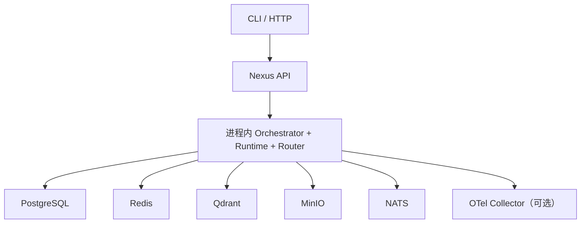
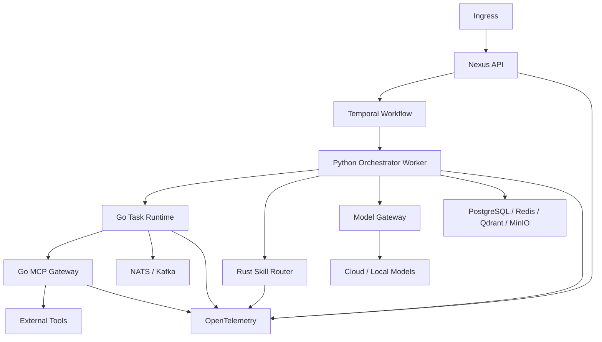

# 容器架构

## 1. 逻辑容器

| 容器 | 职责 | 当前实现 |
| --- | --- | --- |
| Nexus API | 身份上下文、请求校验、运行查询与产物链接 | Python/FastAPI 可选适配器 |
| Orchestrator | Goal、Task DAG、Agent/Skill 选择、上下文与评审 | Python 参考内核 |
| Task Runtime | 执行租约、有界并发、超时、重试、幂等 | Go 核心实现 |
| Skill Router | RRF、策略过滤、加权排序、预算选择 | Python 参考实现与 Rust 内核 |
| MCP Gateway | Tool 发现、权限、风险、幂等与审计 | Go 核心实现 |
| Model Gateway | 模型选择、统一请求、Token 与降级 | Python 契约与 HTTP 适配器 |
| Memory Service | Working、Episodic 与 Semantic Memory | Python 端口与内存实现 |
| Evaluation | Router、Agent 与 PRD 质量基准 | Python 评估包 |
| Nexus Studio | Run、图、Skill、Tool、成本和 Benchmark 界面 | 后续里程碑 |

## 2. 单机开发拓扑

开发拓扑优先可复现与低运维成本。Go、Rust 代码可以独立测试，但默认不要求每次本地运行都跨进程调用。

## 3. 生产目标拓扑

生产拓扑是目标状态，不代表当前所有适配器均已完成。每个远程组件都必须先通过契约测试和性能准入。

## 4. 扩缩容

- API、Router 与 MCP Gateway 采用无状态请求，可按 CPU 或请求延迟水平扩容。
- Runtime Worker 按队列深度、执行中任务数与下游限流扩容。
- Orchestrator Worker 按活动队列扩容，但同一 Workflow 的业务状态只由一个持久化来源协调。
- PostgreSQL、Qdrant、Redis 和对象存储按各自产品的高可用方式部署，不由 NexusOS 自行复制。
