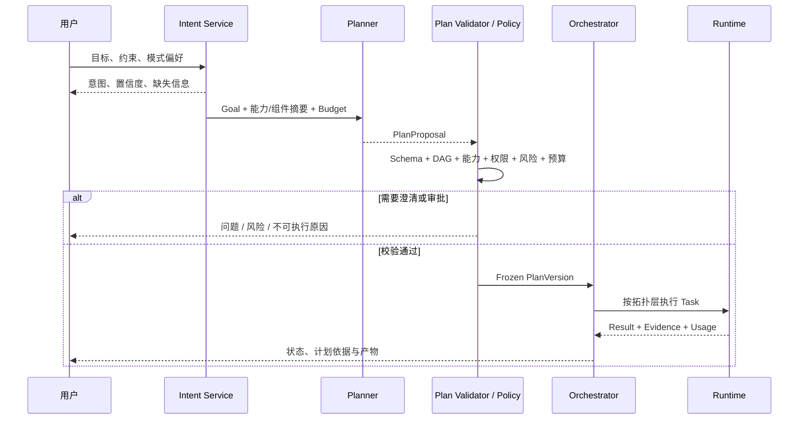
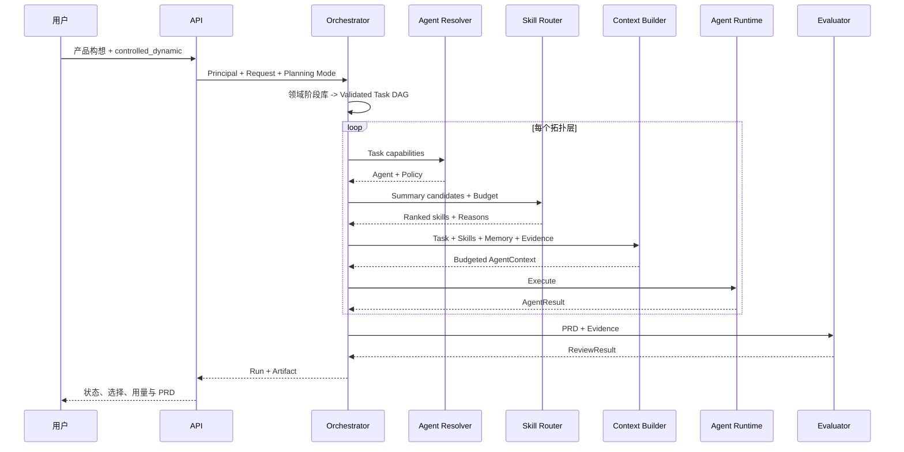

# 核心数据流

## 1. 通用 Intent-to-DAG 运行



目标架构中，`ai_dynamic` 由模型提出非模板化图，`controlled_dynamic` 从版本化领域阶段库选图，两者统一校验、冻结、执行和追溯。AI 的原始提案永远不是 Runtime 输入。当前 `nexusos.planning` 已实现两次模型调用、计划校验、SQLite 冻结版本及文本拓扑层执行；与现有 PRD 管线尚未完全统一，工具、审批和完整预算仍按[实施设计](../development/ai-dag-planning.md#当前状态)推进。

## 2. PRD 运行



## 3. Skill 路由

```text
Task -> Domain Hints -> Metadata Filter
     -> Dense Results + Sparse Results -> RRF
     -> Reranker -> Policy Filter -> Cost/Latency Score
     -> Token Budget -> 1~5 SkillSummary -> Load SkillPackage
```

未选中的 Skill 正文不读取。策略拒绝发生在最终执行上下文构建之前，拒绝原因进入路由记录。

## 4. Tool 调用

```text
AgentResult / Model Tool Call
 -> server-side Principal
 -> Agent Tool Policy
 -> Risk and Schema Validation
 -> Idempotency Reservation
 -> MCP Invocation
 -> Audit + Trace + Result
```

网络重试复用原幂等键。高风险动作需要 Human-in-the-loop 时，Gateway 返回等待审批状态，而不是自行降级授权。

## 5. 评审与重规划

```text
PRD -> Deterministic Rules -> Dimension Scores
    -> Blocking Issues + Revision Tasks
    -> pass: Artifact Delivery
    -> revise: Replanner -> Incremented Iteration -> Affected Tasks
```

当前参考运行完成确定性质量门。完整 Replanner 将复用未受影响结果，并限制最大迭代次数和累计 Token。
