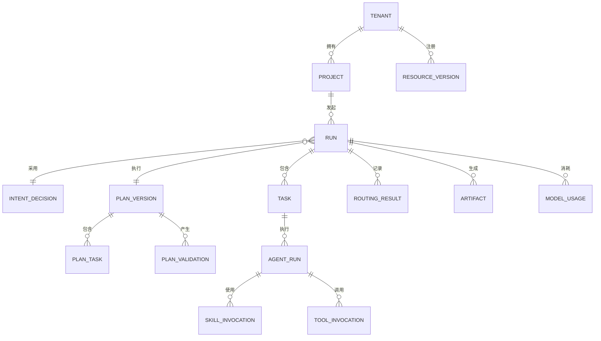

# 数据模型

目标架构由 PostgreSQL 保存租户、主体、项目、资源版本、Run、Task、Agent 执行、Skill 与 Tool 调用、路由结果、产物元数据、Memory、模型用量和审计日志。PRD 正文等大对象进入 MinIO，Skill 与知识向量进入 Qdrant。

当前个人本地实现使用 SQLite：AI 规划的 `nexus_plans` 保存不可更新的 JSON 计划快照（输入、意图、提案、校验问题、绑定及摘要），`nexus_planning_events` 保存规划模型调用事件，`nexus_plan_runs` 保存唯一执行占用、节点结果和执行用量。以下实体图是目标模型，不代表已经部署 PostgreSQL/MinIO 或实现租户隔离；实际字段见 `nexusos/planning/schemas.py` 与 `store.py`，边界见[实施状态](../development/ai-dag-planning.md#当前状态)。

`INTENT_DECISION` 保存规范化意图、领域、置信度、缺失信息、候选工作台和识别依据。`PLAN_VERSION` 保存 `ai_dynamic` 或 `controlled_dynamic` 模式、Planner 模型与 Prompt/Schema 版本、能力注册表快照、原始提案摘要、最终图摘要、预算、审批状态及被替换版本。`PLAN_TASK` 保存依赖、所需能力、输入来源、预期产物、完成条件和风险级别；执行态 `TASK` 引用冻结的 `PLAN_TASK`，不能反向改写计划。

AI 提案、校验问题和拒绝结果同样需要留痕，但只有状态为 validated/frozen 且满足 Policy 的计划可以绑定 Run。Replan 创建新的 `PLAN_VERSION`，不覆盖旧图；模式切换也视为新计划。PRD 文档任务默认记录 `controlled_dynamic`，未来选择 `ai_dynamic` 时必须显式保存该选择。

所有操作表包含 `tenant_id`，既用于查询分区，也为后续 Row Level Security 提供基础。资源定义不可原地覆盖，每个版本以名称、语义版本和内容摘要唯一标识，使历史运行可以准确回放。

Tool 调用在租户内以幂等键唯一，避免跨服务重试产生重复副作用。审计日志只记录决策元数据，不默认存放提示词或产物正文。
