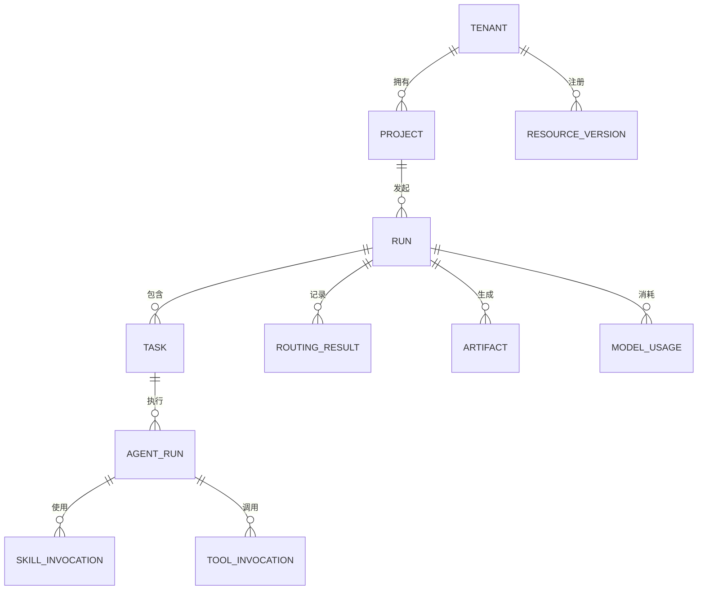

# 数据模型

PostgreSQL 保存租户、主体、项目、资源版本、Run、Task、Agent 执行、Skill 与 Tool 调用、路由结果、产物元数据、Memory、模型用量和审计日志。PRD 正文等大对象进入 MinIO，Skill 与知识向量进入 Qdrant。

所有操作表包含 `tenant_id`，既用于查询分区，也为后续 Row Level Security 提供基础。资源定义不可原地覆盖，每个版本以名称、语义版本和内容摘要唯一标识，使历史运行可以准确回放。

Tool 调用在租户内以幂等键唯一，避免跨服务重试产生重复副作用。审计日志只记录决策元数据，不默认存放提示词或产物正文。
