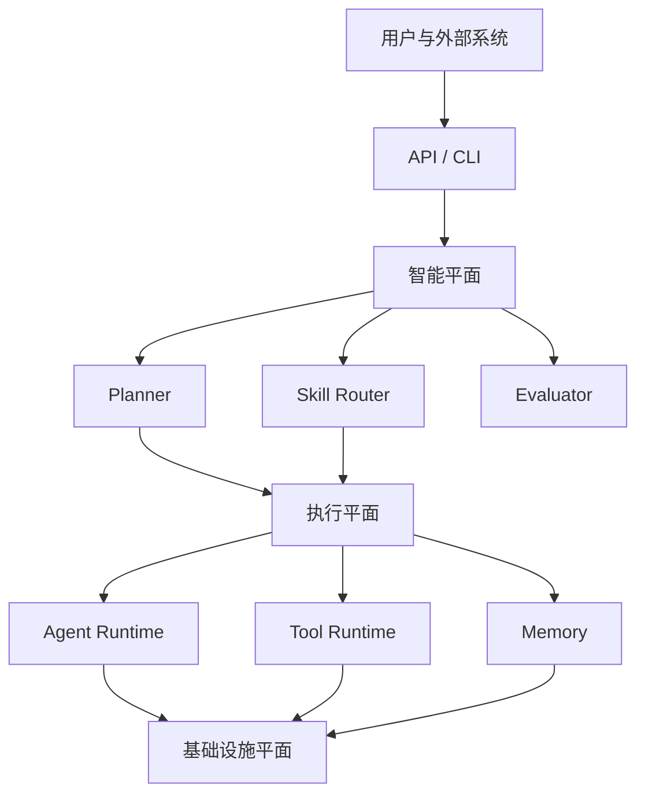

# 架构总览

## 核心思想：AI 理解任务，按需组装能力与界面

> **纽带系统以用户任务为中心：由 AI 分析需求，从已注册的能力和组件中选择、组合完成任务所需的工作环境。界面只呈现当前任务需要的组件，同一功能只有一个主要入口，不重复铺设，不为无关能力硬占位。**

这是系统核心设计约束，适用于 PRD 及后续全部任务。**保留软件式工作台外壳（菜单、工具栏、左侧管理、中间编辑、右侧 AI、底部状态），通过分组、去重和按需展开优化秩序；按需组装不等于取消软件式界面。** PRD 的业务内容是简报、正文编辑与 AI 协作；材料、绘图、版本、追溯按需管理。新需求通过分析与组件组合扩展，不复制包含所有功能的固定工具页。重组界面不得丢失用户数据或执行现场。

当前已实现可复用工作台组件，PRD 使用确定的任务组合规则；跨任务 AI 组件组合规划仍是目标能力。详见[组件组合与设计验收约束](../development/studio-workbench.md)。

## 1. 定位

NexusOS 是面向复杂智能任务的大规模 Agent 协同基础设施。它通过动态任务规划、分层 Skill 路由、上下文工程、工具互操作、记忆、评估与可观测性，为不同参考应用提供统一运行底座。

PRD 生成只是第一个参考应用，不是 NexusOS 本身。未来的软件开发、深度研究、数据分析与设计应用应复用同一组核心契约。

## 2. 核心问题

当系统拥有成千上万个 Skill、多个异构 Agent、大量工具和不同模型时，如何以低 Token、低延迟和可解释的方式选择能力、规划任务并完成协作。

## 3. 架构平面



智能平面回答“应该做什么”，执行平面回答“如何可靠地完成”，基础设施平面提供持久化、消息、观测与安全能力。

## 4. 核心资源

| 资源 | 定义 | 主要职责 |
| --- | --- | --- |
| Agent | 角色、目标、状态与策略的组合 | 承担任务并组织能力 |
| Skill | 可复用的认知能力 | 提供指令、示例和引用资料 |
| Tool | 对外部世界产生动作的能力 | 搜索、文件、数据库或业务 API 调用 |
| Memory | 可检索的历史与知识 | 为当前任务补充必要上下文 |
| Workflow | 可复用执行模式 | 定义依赖、并发、重试和人工确认 |

这五类资源均应可注册、可发现、可版本化、可授权和可观测。

## 5. 设计原则

1. **Contract First**：领域层只认识 NexusOS 契约。
2. **渐进加载**：先检索元数据，选中后再加载 Skill 正文与资源。
3. **智能与执行分离**：模型推理不承担可靠调度职责。
4. **证据与评估优先**：路由与结果必须可度量，不以主观演示代替基准。
5. **先模块化、后分布式**：第一阶段保持低运维成本，同时预留远程适配器。

## 6. 参考执行路径

```text
用户目标 -> Intake -> Planner -> Task DAG -> Agent Resolver
         -> Skill Router -> Context Builder -> Agent Runtime
         -> Tool / Memory -> Reviewer -> Replan 或产物
```
