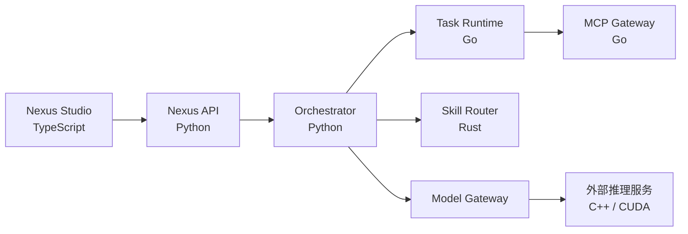

# 多语言架构设计

## 1. 目标

NexusOS 采用“按负载特征选择语言”的多语言架构，不为展示技术栈而拆服务。Python 保留 AI 生态与快速迭代优势；Go 承担高并发 IO 与调度；Rust 承担低延迟、CPU 密集且需要内存安全的排序；TypeScript 构建控制中心；C++ 仅通过外部推理服务进入系统。

| 模块 | 主要语言 | 原因 |
| --- | --- | --- |
| Intent Service、AI/受控 Planner、Plan Validator、Agent 逻辑、LangGraph Runtime | Python | AI 生态、领域建模、确定性校验与实验效率 |
| Task Runtime、Scheduler | Go | 轻量并发、稳定部署与网络服务 |
| MCP Gateway | Go | 多连接 IO、超时、限流和策略执行 |
| Skill Router | Rust | 低延迟排序、批量计算与内存安全 |
| Nexus Studio | TypeScript | 类型化 Web 工程与交互生态 |
| Model Runtime | 外部 C++/CUDA 服务 | 复用 vLLM、llama.cpp 或 TensorRT，而非重复造轮子 |

## 2. 边界

Python 模块化单体仍是功能参考实现。Go 与 Rust 服务通过版本化 JSON 契约接入，并提供明确超时、幂等键和降级策略。只有压测证明远程服务收益大于网络与运维成本时，部署才启用远程模式。

## 3. 数据所有权

- Python 智能平面拥有 Intent 决策、AI/受控计划提案、确定性校验、不可变计划版本与业务运行状态。
- Go Runtime 拥有执行租约、队列消费与尝试记录，不拥有业务目标。
- Rust Router 只接收轻量候选元数据并返回排序解释，不加载 Skill 正文。
- MCP Gateway 拥有连接池和调用审计，不决定 Agent 是否有业务权限。
- Studio 只呈现服务端状态，不作为任何运行状态的主数据源。

## 4. 失败与降级

- Go Runtime 不可用时，本地开发可回退到进程内 Runtime。
- Rust Router 不可用时，可回退到 Python Router，并记录降级指标。
- MCP Gateway 超时不会自动扩大工具权限，重试必须复用幂等键。
- 模型服务失败由 Model Gateway 根据策略选择允许的备用模型。

## 5. C++ 的使用原则

系统主要瓶颈是模型响应、网络、存储和任务调度，并非普通循环。核心团队不自研推理内核；需要本地模型时，通过 Model Gateway 对接成熟的 C++/CUDA 推理服务。只有出现可复现热点且现有服务无法满足时，才考虑单独的原生扩展。
