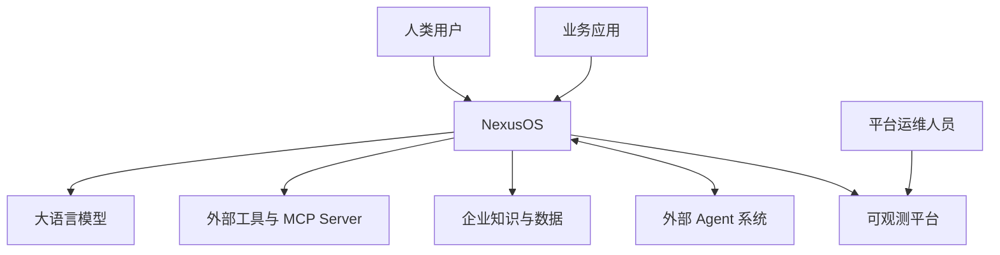

# 系统上下文

## 1. 系统边界

NexusOS 负责意图识别、AI/受控任务规划、计划校验与版本冻结、Agent 协调、Skill 管理、工作流执行、上下文构建、结果评估和运行审计。模型推理、外部工具、企业知识与底层数据服务由外部系统提供。

模型可以为任意已注册能力能够承接的任务提出 DAG，但 NexusOS 的系统边界包含确定性校验与 Policy Enforcement：模型提案不能直接变成外部动作。用户可以选择 `ai_dynamic` 或领域提供的 `controlled_dynamic`；PRD 永久保留后者。

## 2. 外部参与者

- 人类用户通过 Studio、CLI 或 API 创建任务、确认高风险操作并获取产物。
- 业务应用通过稳定 API 嵌入 NexusOS 能力。
- 模型供应商提供推理，NexusOS 不绑定单一厂商。
- 工具服务提供搜索、文件、代码和数据库等外部动作。
- 外部 Agent 通过互操作协议发现能力并交换任务状态。
- 可观测平台接收 trace、metric、log、Token 与成本数据。

## 3. 安全边界

任何外部能力调用必须依次经过身份识别、租户隔离、策略判断、参数校验与审计记录。模型产生的工具参数不直接获得执行权限。

## 4. 非目标

- 不在核心仓库中实现通用模型推理框架。
- 不重新实现 PostgreSQL、Redis 或向量数据库。
- 不保证任意第三方 Skill 默认可信。
- 不把 PRD 参考应用的领域规则写入通用核心。
