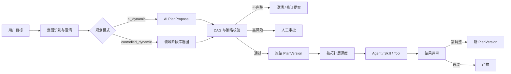

# AI 自主任务规划实施设计

本文落实 [ADR-0006](../adr/0006-ai-planned-task-graphs.md)。目标是让 NexusOS 面对任意**已注册能力可以承接**的用户任务时，先识别意图，再由 AI 提出可解释的任务 DAG，经确定性校验和策略授权后执行。这里的“任意”指图结构不受某一业务模板限制，不代表能力、权限、成本或安全边界无限。

## 产品定位与双模式

| 模式 | 标识 | 适用场景 | 计划所有者 |
| --- | --- | --- | --- |
| AI 自主规划 DAG | `ai_dynamic` | 通用研究、开发、数据、设计及后续未知组合任务 | AI 提议，NexusOS 验证并冻结 |
| 任务驱动的受控动态流程 | `controlled_dynamic` | PRD、合规、高风险、要求稳定回归的领域流程 | 领域阶段库定义边界，系统按任务选取 |

PRD 当前默认且始终保留 `controlled_dynamic` 选择项。模式选择属于一次 Run 的输入：界面、API、版本历史和 Trace 必须显示；策略强制覆盖用户选择时必须解释原因。切换模式会创建新计划，不能修改已经执行的计划版本。

## 端到端流程

AI Planner 输入只包含完成规划所需的数据：规范化目标、约束、验收标准、数据分类、预算、当前 Agent/Skill/Tool/组件摘要及策略提示。未选中的 Skill 正文、凭据和敏感 Tool 参数不进入规划上下文。

## 核心契约

`IntentDecision` 至少记录 `intent_id`、领域、置信度、缺失信息、候选工作台和识别依据。低置信度不应靠猜测进入执行。

`PlanProposal` 至少包含：

- `goal`、约束和可验证验收条件；
- 任务 ID、标题、目标、依赖和所需能力；
- 每个节点的输入来源、预期产物、完成条件、风险级别和预算建议；
- 计划依据、假设、待确认问题及建议的工作台组件；
- Planner 模型、Prompt/Schema 版本和能力注册表快照标识。

`PlanVersion` 是验证后的不可变快照，增加 `plan_id`、版本、模式、状态、图摘要、验证结果、审批结果及替换的旧版本。Run 只引用一个已冻结版本；Replanner 通过新版本表达变化。

## 确定性校验

服务端至少执行以下校验，模型不得自行声明通过：

1. Schema、字符长度、节点数、图深度、扇出和总预算在租户策略内。
2. Task ID 唯一，依赖存在，图无环，至少一个入口和一个可交付出口。
3. 所需能力存在，至少一个 Agent 可覆盖；Tool、数据域和网络访问符合 Policy。
4. 每个节点具有可判定的完成条件；关键产物有消费者或属于最终交付。
5. 高风险副作用在执行前有显式审批节点，审批不能由产出动作自身绕过。
6. 并行节点没有隐含写冲突；共享资源需声明串行、锁或幂等键。
7. 估算 Token、费用、耗时和重试上限；超限进入澄清或重新规划，不静默删任务。

非法提案保留在 Trace 中并标为 rejected，但不进入 Runtime。允许在固定次数内把结构化校验问题交给 Planner 修订；超过次数后停止并向用户解释。

## Studio 交互

首页从关键词匹配升级为真实意图识别后，应显示识别到的目标、置信度、缺失信息和建议工作台。任务启动前提供规划模式选择与 DAG 预览；节点展示目标、依赖、能力、风险、预算和依据。用户可以要求重新规划，但不能直接编辑出越权能力。

PRD Studio 保留“任务驱动的受控动态流程”选项并作为现阶段默认。其流程可根据 `prototype/generate/revise/review`、需求复杂度和已有产物选择节点，但需求与范围、写作质量门和独立评审等关键约束由版本化阶段库维护。`ai_dynamic` 达到真实样本验收后可作为显式实验选项，选择结果进入文档任务历史。

工作台组件计划与执行 DAG 相关但不是同一对象：Task 声明所需交互能力，组件注册表把它映射到已注册界面；AI 不能输出任意 React、HTML 或脚本。隐藏或重组组件不影响已冻结 DAG 和运行现场。

## 实施顺序

1. 定义 `PlanningMode`、`IntentDecision`、`PlanProposal`、`PlanVersion` 和验证问题契约，并为现有 PRD 计划补记 `controlled_dynamic`。
2. 实现独立 Intent Service 与 Model Planner，只生成结构化提案；建立恶意/畸形输出测试集。
3. 实现服务端 DAG Validator、能力解析预检、预算器、Policy/HITL 门和计划版本存储。
4. 让 Orchestrator 只接收 validated/frozen 计划；增加计划事件、模型用量和 Replan 版本链。
5. 在通用 Studio 接入意图结果、模式选择、图预览、澄清和拒绝态；PRD 接入受控模式选择。
6. 用 PRD、研究、代码变更、数据分析和不支持任务做真实模型评测，再决定通用入口是否默认 `ai_dynamic`。

## 验收门

- 同一模型面对至少四类真实任务能产生领域不同、依赖合理且包含并行机会的 DAG，不套用 PRD 固定节点。
- 循环依赖、未知能力、越权 Tool、缺少完成条件、超预算和过大图全部在执行前被拒绝，拒绝时零 Tool 副作用。
- 相同输入、模式、Prompt、模型和注册表快照可查；计划提案、修订、验证与最终版本能够完整回放。
- Planner 调用和任务执行 Token 分开计量；规划失败不被计为任务完成。
- PRD `controlled_dynamic` 回归样本保持关键质量门，用户可显式选择且历史记录可见；通用 AI Planner 上线不删除或暗中替换该模式。
- 高风险计划必须停在审批前；拒绝审批后后续依赖节点不执行。
- Intent 置信度不足或能力不支持时进入澄清/拒绝，不生成虚假产物或偷偷降级到无关工具。

## 当前状态

2026-09-11 已加入第一批代码：`nexusos.planning` 包含严格的 `PlanRequest`、`IntentDecision`、`PlanProposal` 输入契约；独立模型调用先识别意图，再生成任意节点与依赖的提案。服务端检查唯一 ID、依赖存在、无环、节点数（12）、深度（8）、扇出（6）、Agent 完整能力覆盖、节点输出预算和风险。低置信度（<0.7，模型自评而非校准概率）进入澄清；工具调用或非低风险计划直接拒绝。

当前执行器仅支持文本输出，没有连接任何外部工具。Agent 必须完整覆盖节点能力；所选 Skill 必须无需工具、风险为 low，正文只在选中后读取并随绑定冻结。计划、能力目录摘要、模型/Prompt/策略版本、模型提案和用量写入现有 SQLite 的 `nexus_plans`，模型请求在发送前写入只追加的 `nexus_planning_events`。计划快照禁止更新，重新规划通过 `supersedes` 创建新记录。执行前验证摘要与当前能力目录；目录或模型变化要求重新规划。

`nexus_plan_runs` 使用事务性唯一执行占用，重复点击不重调模型。执行按 `TaskGraph` 拓扑层并行，单服务最多 3 个模型调用、2 个执行任务，执行队列最多 8 项。节点失败阻止其后续层；同层已完成产物保留。进程重启将未完成执行标为 interrupted，不自动重放；当前不支持复用节点的检查点恢复，需显式重新规划执行。规划阶段最多两次模型调用，每次超时 120 秒，未实现自动提案修复。费用和总输入 Token 硬上限仍待实现；当前预算仅限制节点声明的输出 Token 总和与模型请求的输出上限，节点上下文超过 100,000 字符则失败。

当前入口为首页输入目标 → `/orchestrate` 编排页 → `/workspace` 任务专属工作台，不再提供独立 AI 规划快捷入口。识别意图后按注册元数据排序检索候选（最多 8 个 Agent、12 个无需工具的低风险 Skill），模型选择 agent_id / skill_ids 并提出依赖。未显式选择时保持确定性兼容匹配；所有选择均经过服务端能力及 Skill 兼容校验。用户可增删任务、修改目标/依赖/Agent/Skill/验收条件；revision 创建新冻结版本，不修改旧图，且必须重新确认。`nexus_plan_confirmations` 保存 plan_id、digest 与确认时间；未确认计划不能通过执行 API。确认只打开工作台，不执行；运行由工作台中的独立命令触发。工作台仅展示该版本绑定的 Agent/Skill 与实际插件（当前为空）。旧 `/task-studio` URL 重定向到新编排页；PRD 保留受控选项及入口。

尚待实现：外部工具与 HITL 审批、租户策略、跨任务写冲突校验、累计成本硬预算、自动 Replan/结果复用、正式通用产物质量门、PRD 内 AI 模式及四类真实模型任务的质量评测。当前测试用受控模型响应验证协议与执行语义，不能代替真实模型规划质量验收。实验入口仅供个人本地工作区，不能宣称已经可以执行任意外部动作。
