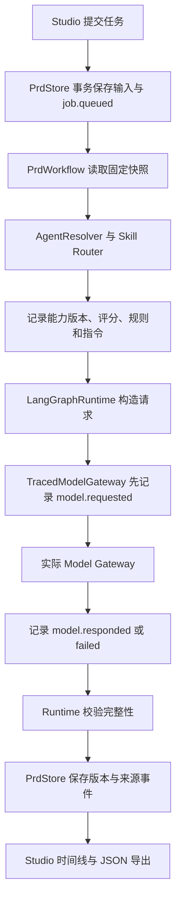

# RT-001：PRD 全程追溯

状态：已实现单实例 PRD 写作链路，待真实模型运行检验规模与保留成本。发现和实现日期：2026-09-10。优先级：P0。

关联需求：在继续扩展长任务、记忆、恢复、重试、并发与调度前，每个输入和产物首先要能够追溯。总体待办见[关键运行问题台账](../critical-runtime-backlog.md)。

## 1. 问题是怎样发现的

检查对象为前一轮持久化 PRD 工作区，而非最早的离线演示版本。检查基线提交为 `b65afcc`。

| 检查步骤 | 证据 | 发现的问题 |
| --- | --- | --- |
| 读取 `prd/store.py` 的 `start_job` | 任务保存 action、instruction、steps 和用量，没有输入快照 | 后续改动简报后，无法准确还原某次运行用了什么材料 |
| 读取 `prd/workflow.py` 的 `_author` | 执行时读取当前 document | 执行依据隐含依赖最新文档，而非被固定的启动版本 |
| 检查 Studio 初始化 | 只按 `last_job_id` 读取最近任务 | 老任务仍在数据库里，但用户不能完整浏览和关联 |
| 检查 LangGraph 与 Model Gateway 边界 | Runtime 只回传成功的 AgentResult | 模型截断、过滤、错误等情况可能没有可检查的原始响应 |
| 检查 `_version` | 快照含 brief、content、note，没有产生它的 job | 文档版本无法直接关联到具体模型调用 |
| 检查状态更新与重启恢复 | job JSON 被覆盖，恢复仅写最终失败状态 | 丢失状态变化顺序及中断时处于哪个阶段 |
| 检查现有 `observability/telemetry.py` | 使用内存 sink，字符串有长度裁剪 | 适合作为诊断摘要，不能承担保存完整输入输出的审计依据 |

复现场景：生成一稿 → 修改材料 → 再次修订 → 首次输入和任务不在界面可查；写作输出被截断 → Runtime 判失败 → 只有错误文案，没有被拒绝的响应可比较。

这里的问题是“证据链不完整”，不能靠给日志多加几行来解决。排查必须同时覆盖状态存储、模型边界、产物版本和展示入口。

## 2. 本次验收范围

覆盖已被服务器接受的 PRD 文档与任务：创建、保存、版本恢复来源、任务输入、能力选择、模型调用、成功/失败/停止/重启中断、评审、正文版本及显式重新执行关系。

不包括浏览器每次按键、所有 HTTP 参数校验失败的访问审计、尚未接入的工具调用、供应商内部执行和模型内部思维链。身份仍为个人工作区的 `local_user`，不是企业身份审计。

旧数据缺少的证据不补造。`legacy_incomplete` 表示没有当时的请求和快照，原有阶段结果仍可查看。

## 3. 技术选择与嵌入位置

### 3.1 事务内只追加事件，而非覆盖日志

新增 `nexusos.prd.trace` 模块，`PrdStore` 初始化时添加两张表：

| 表 | 内容 | 作用 |
| --- | --- | --- |
| `prd_trace_events` | sequence、event_id、document_id、job_id、trace_id、span_id、parent_span_id、name、occurred_at、payload_hash | 按数据库序列排列事件，用标识连接文档、任务和调用 |
| `prd_trace_objects` | hash、body | 保存规范化 JSON 载荷，以 SHA-256 寻址并去重 |

事件正文用 `ensure_ascii=False + sort_keys=True + 紧凑分隔符` 规范化，再按 UTF-8 字节计算 SHA-256。读取时重新校验，避免把缺失或损坏内容作为有效快照。

对两张表创建禁止 UPDATE/DELETE 的 SQLite trigger，普通应用写路径只追加。使用 SQLite 的触发器和 `RAISE(ABORT, ...)` 约束写入行为。[SQLite 官方说明](https://www.sqlite.org/lang_createtrigger.html)

创建文档、保存版本、入队、状态转换、发布评审和重启恢复事件，与对应业务变更共用 `PrdStore.connection()` 的事务。插入事件失败会回滚业务修改，防止显示“保存成功”却没有产物来源。

这属于应用层历史保护。数据库管理员仍能移除 trigger 或替换文件；SHA-256 也不是身份签名，不宣称具备不可篡改存证能力。备份和迁移须包含事件表与对象表。

### 3.2 固定执行输入

`start_job()` 在设置活动任务之前，保存完整文档快照，并记录 `input_hash`、`input_revision`、`input_version`。`job.queued` 事件保留任务动作、修订指令、输入快照和重新执行来源。

`PrdWorkflow._author()` 改为调用 `store.job_input(job_id)`，从当次快照取得简报、来源、正文和原评审。修改当前文档不会影响旧任务的输入。快照为空的旧任务不能伪装成具备可重放输入。

每个版本追加 `parent_version`、`origin_job_id`、`revision`、`snapshot_hash`；人工载入历史版本后保存，另记 `restored_from_version`。因此能够区分“模型生成 v3”“基于 v2 人工修改”“从 v1 恢复后保存”。

### 3.3 在 Model Gateway 边界记录调用

新增 `TracedModelGateway`，它实现现有 `ModelGateway.complete()` 协议，包装实际供应商 Gateway，再交给 `LangGraphRuntime`：

不在 PRD 应用里复制 HTTP 客户端，也不把供应商 SDK 放进编排器。包装层保存归一化 `ModelRequest` 的完整 messages、model、temperature、maximum_output_tokens、数据分类和关联标识。先成功落盘，再调用外部模型。

响应在 Runtime 判断是否完整之前记录：provider、实际 model、finish_reason、content、输入/输出 Token、调用耗时，以及供应商提供的 `x-request-id`。截断响应会保留证据，但仍被 Runtime 拒绝写成正式正文。

捕获调用失败时记录错误类型和可用的 HTTP 状态，不保存原始异常文本和请求认证头。429/5xx 与永久拒绝仍沿用现有 Gateway 分类。本期不自动重试。

取消本地协程会记录 `model.cancelled`，供应商结果为 `unknown`。当前底层 urllib 请求使用线程，取消等待不等于撤销供应商计算；不得把取消之后无法观测的远端结果记成成功或零费用。

### 3.4 Trace 与 Span 的关联

每次任务生成独立 32 位十六进制 trace_id 和 16 位根 span_id；每个阶段生成子 span，每次模型调用再生成子 span。同一调用的 requested/responded/failed/cancelled 事件复用 span_id。

`LangGraphRuntime` 透传 trace_id/span_id；`TracedModelGateway` 为模型调用建立子 span。兼容 HTTP Gateway 验证标识长度、字符和非零值后发送 `traceparent: 00-{trace_id}-{span_id}-01`。这是 W3C Trace Context 定义的传播格式。[W3C Trace Context](https://www.w3.org/TR/trace-context/)

采用 Trace/Span 父子关联，是为了以后能接 OpenTelemetry 服务端导出与跨服务追踪。[OpenTelemetry traces 概念](https://opentelemetry.io/docs/concepts/signals/traces/)

本期没有安装 OTel SDK、接入 Collector 或宣称实现 Go/MCP/所有 API 请求的分布式追踪。PRD 业务事件是本期持久证据；已有内存 Telemetry sink 保持独立。以后 OTel 摘要只携带关联 ID 和耗时等信息，完整用户正文继续放在受访问控制的产物存储。

2026-09-10 后续选型已由用户确认：**OpenTelemetry 统一采集，Langfuse 承接模型追踪与评测，同时保留当前业务追溯记录**。状态为待实现，具体接入位置、数据上报边界、异步导出故障策略、评测样本与验收条件已列入[RT-001 扩展待办](../critical-runtime-backlog.md)。通用遥测继续使用摘要；模型调试与评测所需正文仅按配置进入允许的 Langfuse 目的地。本地输入、版本与事件仍是业务权威记录，不依赖外部追踪平台保存成功。

### 3.5 记录能力选择的依据

`capabilities.selected` 事件保存所选 AgentDescriptor（ID、版本、角色、能力、域和工具策略），以及 Skill 的 ID、版本、得分、评分分项、实际指令和指令哈希；同时保存路由查询与预算策略。

本次可解释“选中了什么，以及其得分依据”，并通过快照抵抗后续 Skill 文件变化。未保存整个候选库及每个被淘汰候选，不声称可以逐一解释所有未选能力。需要完整路由决策回放时，应扩展 Router 的候选与排除原因契约。

`job.configured` 记录逻辑模型、Gateway 类型、上下文与输出预算、工作流版本和当前 workflow 源码 SHA-256。该哈希不是全仓库构建指纹；模型别名的供应商版本也可能变化，因此“可检查当次输入”不等于“再次执行输出完全相同”。

## 4. 事件语义

| 事件 | 写入时机 | 说明 |
| --- | --- | --- |
| document.created / document.saved | 创建/保存事务内 | 服务器接受的编辑；不是按键日志 |
| artifact.version_created | 版本保存事务内 | 正文、来源、父版本与任务关系 |
| job.queued | 入队事务内 | 固定输入、动作与 retry_of_job_id |
| job.running / job.configured | 开始执行 | 区分排队等待与实际工作 |
| stage.started | 解析阶段前 | 目标、能力与阶段 Span |
| capabilities.selected | 完成选型后 | 实际所选 Agent 和 Skill 依据 |
| context.rejected | 必需输入超预算 | 不静默丢弃材料 |
| model.requested | 外部调用前 | 精确归一化请求，attempt 当前为 1 |
| model.responded | 模型返回后、Runtime 校验前 | 包括被截断的响应证据 |
| model.failed / model.cancelled | 错误/取消等待 | 不编造未知供应商结果 |
| stage.succeeded / failed / cancelled | 阶段结束 | 校验结果和耗时 |
| review.published | 评审写入事务内 | 关联当前正文版本与评审输出 |
| job.cancel_requested | 用户请求停止 | 记录意图，与停止结果分开 |
| job.succeeded / failed / cancelled | 状态转换事务内 | 最终业务结果 |
| stage.interrupted / job.interrupted | 服务启动恢复 | 保留中断前阶段，不自动重放 |

并发事件按数据库 sequence 排序，不依赖系统时钟来判断先后。occurred_at 用于展示实际 UTC 时间，调用耗时使用单调时钟计算。

## 5. API 与 Studio

新增接口：

- `GET /v1/prd/documents/{id}/jobs?before=&limit=`：倒序任务历史，游标分页。
- `GET /v1/prd/documents/{id}/trace?after=&limit=`：按 sequence 递增的文档事件，最多 500 条/页。
- `GET /v1/prd/jobs/{id}/trace`：一次任务的输入、全部已记录事件、产物来源与任务状态，作为 JSON 证据包。

Studio 新增“全程追溯”页签。用户可选择历史任务，展开每个事件检查输入/输出和关联标识，导出追溯 JSON，也可切换文档时间线查看手动保存。

同源代理只转发允许的路径和分页字段。任务侧的 trace_id 会与模型请求中的 `traceparent` 对应，供应商若返回 request ID，可用于与供应商日志对照。

失败或停止任务提供“基于当前文档重新执行”。新任务保存 `retry_of_job_id`，只允许关联同文档的失败/停止任务。已有草稿且失败发生在后续评审时，可重新评审；重新执行使用当前保存版本，旧 Trace 不改写。这是显式重新执行，不是自动退避重试或断点恢复。

导出是一致数据库读取视图。运行中导出的追溯包仅覆盖导出当时已记录的事件，之后可以再次导出。任务证据包目前一次返回完整正文，长期大任务需按台账进一步实现分块读取、外部对象存储和导出容量限制。

## 6. 隐私与可靠性边界

完整 messages 和材料可能含用户写入的敏感内容。系统不记录配置里的 API Key、Authorization 或任意供应商错误原文，但不会声称自动识别并清除用户正文中的所有秘密。追溯 JSON 与原文具有同等敏感性。

当前个人工作区无企业身份/租户隔离，未来企业场景需要按文档权限控制追溯读取与导出、保留周期、删除流程和加密。日志脱敏不能通过截断材料来破坏执行证据，应在产品层清晰选择“受保护完整存储”与“脱敏副本”。

追溯写入失败时不发送新模型请求；版本和对应事件必须一起提交。若物理磁盘持续不可写，连失败事件也可能无法写入，不能承诺总能记录最后一个错误。状态恢复、存储告警与配额处理属于 RT-003/RT-008。

## 7. 验证与结果

集成测试 `tests/integration/test_prd_execution_trace.py` 覆盖：每次调用的父子关系、完整消息、能力依据与产物来源；后续编辑不改变旧证据；截断响应保留但不发布正文；失败后关联新 Trace；取消后的供应商结果未知；事件分页无丢失和重复；trigger 禁止历史修改；审计失败回滚正文；请求记录失败时不调用模型；旧任务标记缺失；版本恢复来源；重启追加中断事件。

`tests/integration/test_prd_model_http.py` 使用真实本机 HTTP 服务验证 traceparent、认证头正常发送但不进入导出、供应商请求 ID、输出上限、用量和请求正文。供应商返回内容为受控测试数据，验证系统边界，不代替真实模型质量验收。

下一步按[待办台账](../critical-runtime-backlog.md)逐项增强任务池、配额、恢复和调度，所有新增能力必须继续生成可关联事件。

本次验证结果：全量 101 项 Python 测试通过，Ruff、Mypy、仓库校验、MkDocs 严格构建与 Studio 生产构建通过。Chromium 在隔离数据库与测试供应商上完成“首次失败 → 关联重新执行 → 五阶段成功 → 选择历史任务 → 查看原始快照 → 导出 JSON → 分页文档时间线 → 刷新重开”验收；成功任务导出含 31 条事件，390px 移动布局没有横向溢出，页面没有脚本错误。真实供应商的内容质量、小时级任务和跨实例负载仍未验证。

## 后续演进：检查点恢复

2026-09-10 在业务追溯基础上新增 LangGraph 持久节点检查点与事务内阶段检查点，前端提供“重新执行”和“继续执行”。本文前述“没有断点恢复”为首期交付边界；当前显式阶段恢复的具体契约、来源校验与故障窗口见 [RT-003](003-checkpoint-recovery.md)。OpenTelemetry / Langfuse 仍为待实现选型。
