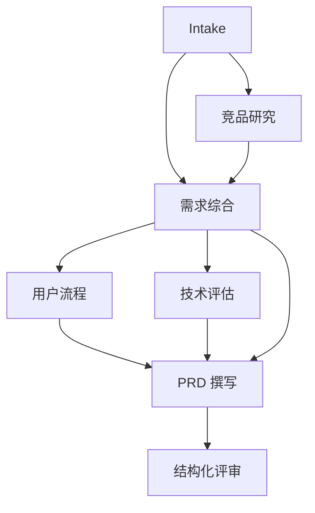

# Planner 与任务图

Planner 的职责是把目标转换为带依赖关系的任务 DAG，不负责直接撰写 PRD，也不指定具体 Agent 名称。每个任务只声明目标、依赖、所需能力和领域提示。

## PRD 标准任务图

企业、多租户、合规或跨平台等复杂需求会增加独立行业研究节点，并与竞品研究并行。这样既保留可预测的参考场景，也验证动态团队和并行调度。

## 不变量

- 任务 ID 在图内唯一。
- 依赖必须指向图内任务。
- 图中不能存在环。
- 每个任务必须能由 Registry 中至少一个 Agent 的能力覆盖。
