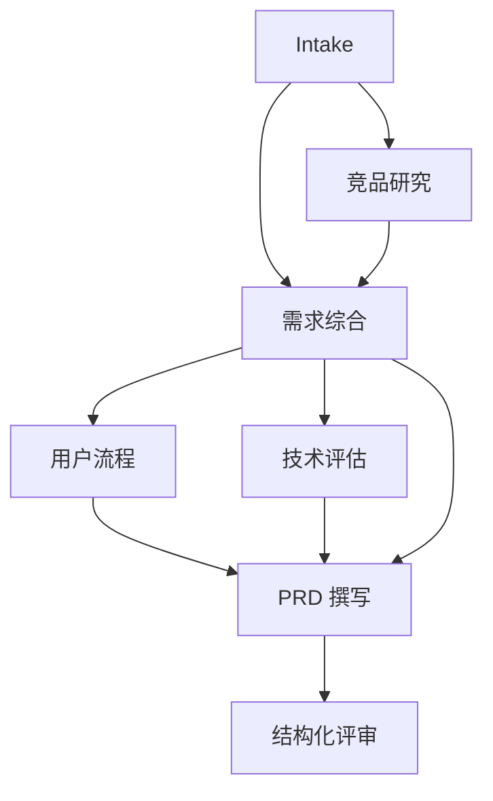

# Planner、意图与任务图

Planner 的职责是把规范化目标转换为带依赖关系的任务 DAG，不负责直接完成任务，也不指定具体 Agent 名称。每个任务声明目标、依赖、所需能力、预期产物、完成条件和风险提示。

NexusOS 长期支持两种一等规划模式：`ai_dynamic` 允许 AI 针对任意已支持任务提出非模板化 DAG；`controlled_dynamic` 从版本化领域阶段库中按任务选图。前者是通用任务的核心演进方向，后者是 PRD 等稳定、高风险或合规流程必须保留的选择。两者都必须经过相同的确定性校验、策略授权和计划版本冻结，详见 [ADR-0006](../adr/0006-ai-planned-task-graphs.md)。

## AI 自主规划

意图识别先形成 Goal、约束、验收条件、缺失信息和候选工作台。AI Planner 只读取 Agent/Skill/Tool/组件的轻量摘要，在预算内输出 `PlanProposal`。提案可以决定节点数量、依赖和并行关系，但不能引入未注册能力或扩大权限。

服务端验证 Schema、唯一 ID、依赖存在、无环、图规模、能力覆盖、Agent 可解析、预算、数据分类、Tool Policy、写冲突和人工审批。通过后生成不可变 `PlanVersion`；失败则澄清、有限次修订或拒绝，不能把非法提案交给 Runtime。当前 `TaskGraph` 和拓扑执行已实现，通用 Intent Service、Model Planner 与计划版本持久化尚待完成，具体顺序见[实施设计](../development/ai-dag-planning.md)。

## PRD 受控动态任务图

PRD 默认使用并永久保留 `controlled_dynamic`：企业、多租户、合规或跨平台等复杂需求会增加独立行业研究节点，并与竞品研究并行；不同 action 可以选择原型、生成、修订或评审节点。这样既保留可预测的领域质量门，也验证动态团队和并行调度。未来可显式试用 `ai_dynamic`，但不得静默替换受控模式。

## 不变量

- 任务 ID 在图内唯一。
- 依赖必须指向图内任务。
- 图中不能存在环。
- 每个任务必须能由 Registry 中至少一个 Agent 的能力覆盖。
- 图规模、深度、扇出、预算和重试次数必须在策略限制内。
- 高风险 Tool 必须存在不可绕过的审批门。
- 最终计划、模式、提案、验证问题和注册表快照必须可追溯。
